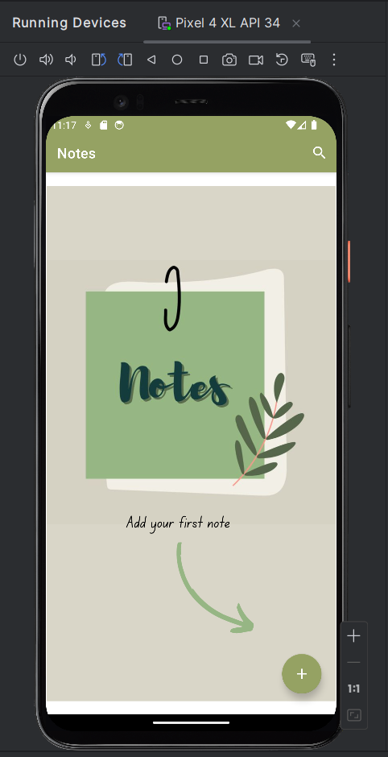
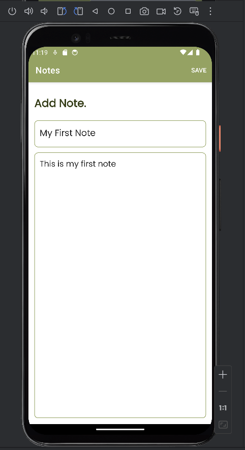
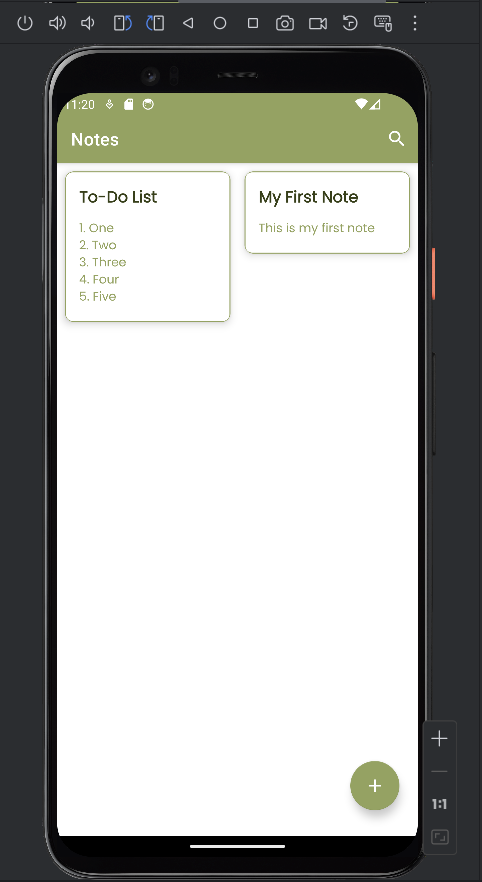
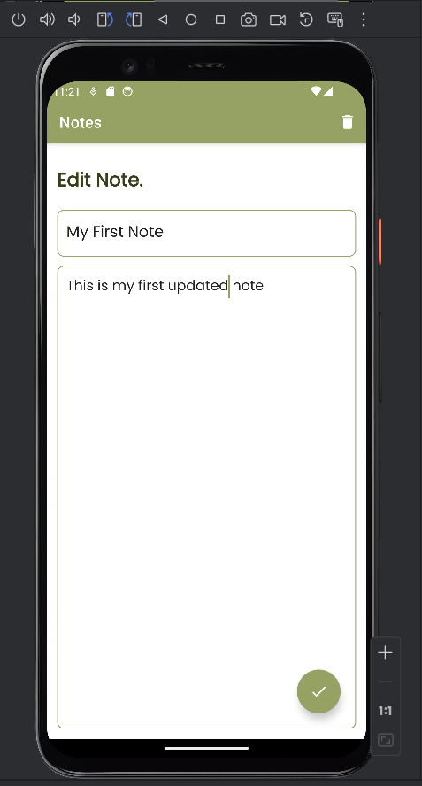
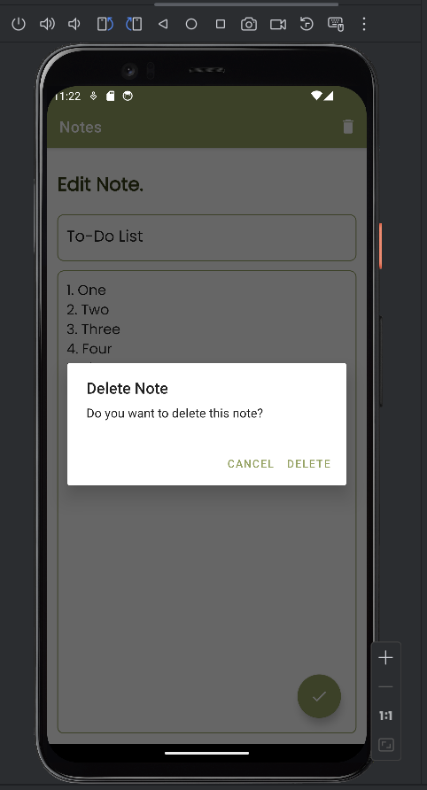
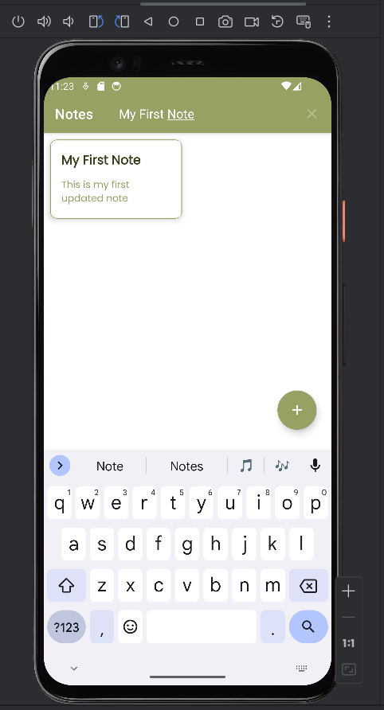

# Notes App

## Description

The Notes App is a versatile note-taking application designed to simplify the process of capturing, organizing, and managing various types of information. With its intuitive interface and comprehensive features, the app empowers users to create, view, edit, delete, and search notes effortlessly, revolutionizing the way users capture and access important information.

## Features

- Create Notes: Quickly jot down thoughts, ideas, tasks, or any other information with ease.
- View Notes: Access your entire collection of notes within the app, providing a centralized hub for all your important information.
- Edit Notes: Modify and update your notes as needed, whether it's correcting typos, adding additional details, or reorganizing content.
- Delete Notes: Easily remove obsolete or irrelevant notes from the app to maintain a clutter-free workspace.
- Search Notes: Quickly locate specific information within a large collection of notes using the powerful search functionality.

## App Demo

Home Page

Add Note

Edit Note

Delete Note

Search Note

